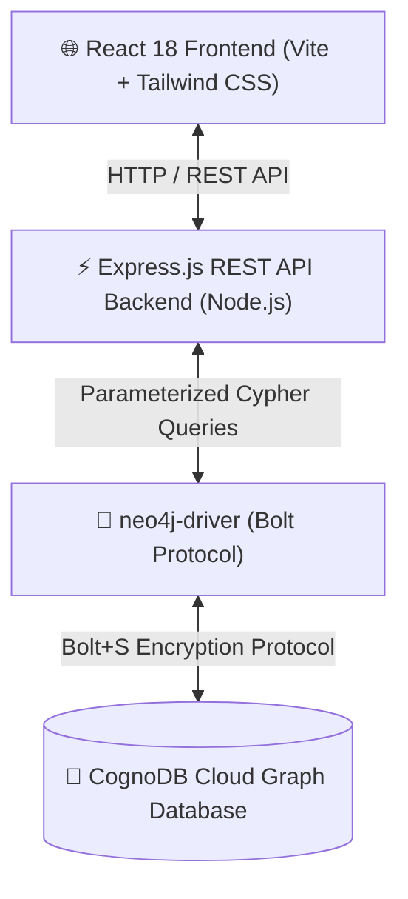
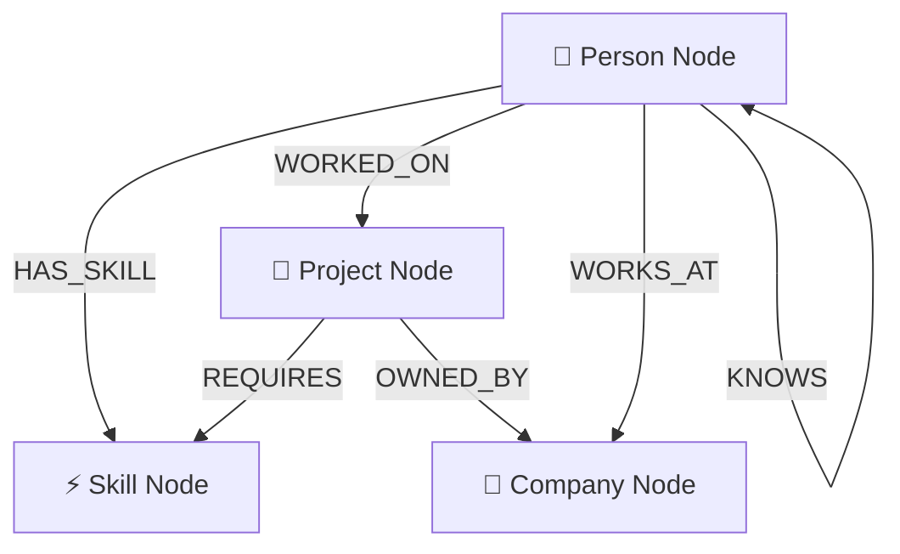

# SkillConnect 🌐

> **Discover people, skills, and projects through connected data.**

SkillConnect is a full-stack graph-powered discovery platform built for the **Wexa AI Software Engineer (Full-Stack / Web)** assessment. The application uses **CognoDB** (connected via the official Neo4j-compatible `neo4j-driver` Bolt protocol) as its primary graph database layer and executes real parameterized Cypher queries for multi-hop graph traversals, skill recommendations, and talent matching.

---

## 📌 1. Use-Case & Problem Statement

In modern tech organizations:
- **Engineers** possess dynamic combinations of technical skills and past project experience.
- **Projects** require specific multi-technology skill combinations and team roles.
- **Companies** manage talent pools and project portfolios.

Traditional relational database queries struggle to answer complex network questions like:
- *"Which active projects match 75%+ of an engineer's possessed skills across multi-hop relationships?"*
- *"Who are the engineers connected through 2-hop collaborator networks who have experience in CognoDB and System Design?"*

**SkillConnect solves this problem** by modeling people, skills, projects, and companies as a property graph. By performing native Cypher pointer traversals, SkillConnect delivers real-time skill matching, match percentage scores, and interactive graph visualizations.

---

## 💡 2. Why a Graph Database? & Why CognoDB?

### Why a Graph Database?
Relational databases (SQL) store entities in separate tables. To discover multi-step connections (e.g. `Person -> Skill -> Project -> Company`), SQL requires multiple expensive `INNER JOIN` operations across junction tables like `Person_Skills`, `Skill_Projects`, and `Project_Companies`. As the dataset grows, multi-join queries suffer exponential join latency.

Graph databases store relationships as first-class physical pointers. Traversing from a `Person` node to their `Skill` nodes and onward to matching `Project` nodes occurs in **O(1) pointer operations per step**, regardless of overall database size.

#### SQL JOIN vs Cypher Multi-Hop Comparison

| Operation | SQL (Relational) | Cypher (CognoDB Graph) |
|---|---|---|
| Single Hop (`Person -> Skill`) | `SELECT ... JOIN Person_Skills` | `MATCH (p)-[:HAS_SKILL]->(s)` |
| 2-Hop Traversal (`Person -> Skill -> Project`) | 3 JOINs across 4 tables | `MATCH (p)-[:HAS_SKILL]->(s)<-[:REQUIRES]-(prj)` |
| Collaborator Network (`Person -> KNOWS*1..2 -> Person`) | Complex recursive CTEs / 5+ JOINs | `MATCH (p)-[:KNOWS*1..2]-(collab)` |
| Performance Scaling | Degrades exponentially with JOIN depth | Constant-time index-free adjacency |

### Why CognoDB?
- **Neo4j Bolt Protocol Compatible**: Uses standard Cypher syntax (`MATCH`, `MERGE`, `WITH`, `RETURN`).
- **High Performance**: Optimized for fast graph pointer traversals and real-time network recommendations.
- **Cloud Managed**: Managed cloud instance setup with `bolt+s://` URI protocol.

---

## 📐 3. Architecture & Data Model Diagrams

### System Architecture


### Graph Data Model Diagram


### Node Labels & Properties
- **`Person`**: `id`, `name`, `email`, `location`, `bio`
- **`Skill`**: `id`, `name`, `category`, `level`
- **`Project`**: `id`, `name`, `description`, `category`, `status`
- **`Company`**: `id`, `name`, `industry`

### Relationship Types
- `(:Person)-[:HAS_SKILL]->(:Skill)`
- `(:Person)-[:WORKED_ON]->(:Project)`
- `(:Project)-[:REQUIRES]->(:Skill)`
- `(:Person)-[:WORKS_AT]->(:Company)`
- `(:Person)-[:KNOWS]->(:Person)`
- `(:Project)-[:OWNED_BY]->(:Company)`

---

## 🔍 4. Main Cypher Queries Explained

### Query 1: Multi-Hop Skill Recommendation (Match Percentage Calculation)
Matches projects that require skills possessed by a given person and calculates a dynamic match score percentage:
```cypher
MATCH (p:Person {id: $personId})
MATCH (p)-[:HAS_SKILL]->(userSkill:Skill)<-[:REQUIRES]-(prj:Project)
MATCH (prj)-[:REQUIRES]->(allReqSkill:Skill)
OPTIONAL MATCH (prj)-[:OWNED_BY]->(c:Company)
WITH p, prj, c,
     collect(DISTINCT userSkill) AS matchedSkillsList,
     collect(DISTINCT allReqSkill) AS requiredSkillsList
WITH p, prj, c, matchedSkillsList, requiredSkillsList,
     size(matchedSkillsList) AS matchedCount,
     size(requiredSkillsList) AS requiredCount
RETURN prj, c,
       matchedSkillsList AS matchingSkills,
       requiredSkillsList AS requiredSkills,
       matchedCount,
       requiredCount,
       round((toFloat(matchedCount) / toFloat(requiredCount)) * 100) AS matchPercentage
ORDER BY matchPercentage DESC, matchedCount DESC
```

### Query 2: Collaborator Network Recommendations (2-Hop Traversal)
Traverses 2-hop collaborator network `(Person)-[:KNOWS*1..2]-(Collaborator)`:
```cypher
MATCH (p:Person {id: $personId})-[:KNOWS*1..2]-(collab:Person)
WHERE p.id <> collab.id
MATCH (collab)-[:HAS_SKILL]->(s:Skill)<-[:REQUIRES]-(prj:Project)
OPTIONAL MATCH (collab)-[:WORKS_AT]->(c:Company)
RETURN DISTINCT collab, c, prj, collect(DISTINCT s) AS sharedSkills, count(DISTINCT s) AS sharedSkillCount
ORDER BY sharedSkillCount DESC
LIMIT 10
```

### Query 3: Parameterized Global Search
Searches across all node types using lower-case string matching:
```cypher
MATCH (p:Person)
WHERE toLower(p.name) CONTAINS toLower($q) 
   OR toLower(p.bio) CONTAINS toLower($q) 
   OR toLower(p.location) CONTAINS toLower($q)
OPTIONAL MATCH (p)-[:HAS_SKILL]->(s:Skill)
RETURN p, collect(DISTINCT s) AS skills
LIMIT 20
```

---

## 🛠️ 5. Setup & Run Instructions

### Step 1: How to Create your CognoDB Instance
1. Sign in to your [CognoDB Cloud Console](https://cognodb.com).
2. Click **Create New Instance**.
3. Select **Neo4j / Cypher Bolt Protocol**.
4. Once created, open the **Connect Modal** to view your credentials:
   - **Connection URI**: `bolt+s://db-XXXXXXXX.databases.cognodb.com`
   - **Username**: `cognodb`
   - **Password**: `<your_instance_password>`

### Step 2: Configure Environment Variables

Create `backend/.env` file:
```env
COGNODB_URI=bolt+s://db-6849b5e4.databases.cognodb.com
COGNODB_USERNAME=cognodb
COGNODB_PASSWORD=your_cognodb_password_here
PORT=5000
NODE_ENV=development
```

Create `frontend/.env` file:
```env
VITE_API_BASE_URL=http://localhost:5000/api
```

### Step 3: Install Dependencies & Seed Database
```bash
# 1. Install root, backend, and frontend packages
npm run install:all

# 2. Populate CognoDB Cloud instance with idempotent MERGE statements
npm run seed
```

### Step 4: Run Application
In terminal 1 (Backend):
```bash
npm run dev:backend
```

In terminal 2 (Frontend):
```bash
npm run dev:frontend
```

Open [http://localhost:3000](http://localhost:3000) in your browser.

---

## 🖼️ 6. UI Walkthrough & Screenshots

### Dashboard (`/`)
Features real-time graph metrics (queried live from Cypher counts), featured multi-hop project recommendations with match score %, popular skill tags, and recent developers.

### Graph Explorer (`/graph`)
Interactive HTML5 Canvas force-directed visualizer rendering property graph nodes (Person: Indigo, Skill: Emerald, Project: Amber, Company: Rose). Supports zoom, pan, node type filter toggles, and click-to-inspect side panel.

### Person Details & Recommendations (`/people/:id`)
Shows person profile, possessed skills, worked-on projects, and **Multi-Hop Project Recommendations with Match % badges**.

---

## ☁️ Deployment Instructions

### Frontend (Vercel)
1. Import repository to Vercel.
2. Build command: `npm run build`
3. Output directory: `dist`
4. Set Environment Variable: `VITE_API_BASE_URL` = `https://your-backend-url.onrender.com/api`

### Backend (Render)
1. Import `backend` directory to Render Web Service.
2. Build command: `npm install`
3. Start command: `node src/server.js`
4. Set Environment Variables: `COGNODB_URI`, `COGNODB_USERNAME`, `COGNODB_PASSWORD`, `PORT`.